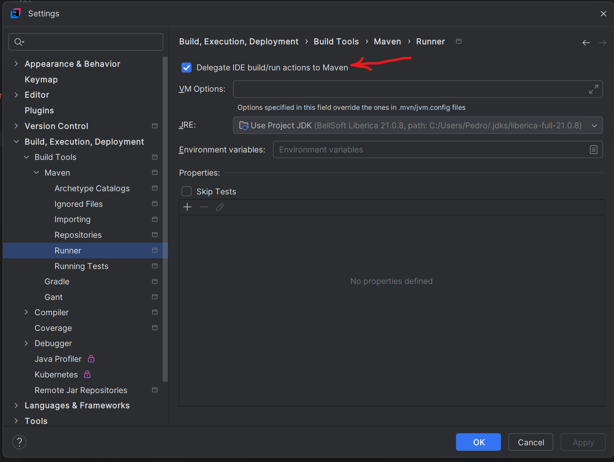
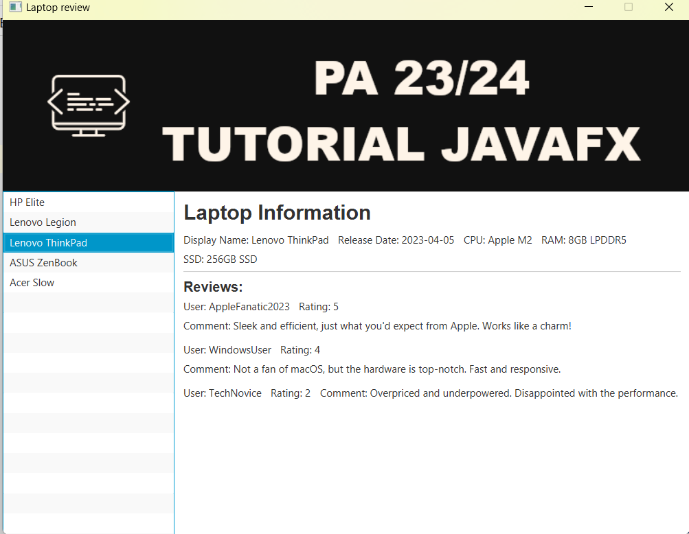

# Programação Avançada | Lab1

:gb: [English version](README_EN.md)

## Objectivos 
- Preparação e adaptação ao ambiente de desenvolvimento
- Revisão do JavaFX para criação de GUI

## 1 - Introdução
### JavaFX 

JavaFX é uma plataforma de software desenvolvida pela Oracle para criar aplicações que executam em ambiente desktop e interfaces (GUIs) em Java. Fornece um conjunto de bibliotecas e ferramentas para criar aplicações gráficas interativas que podem ser executadas nos mais diversos ambientes, incluindo Windows, macOS e Linux. O JavaFX é uma alternativa à tecnologia Swing, que era usada anteriormente para criar GUIs em Java.

### Maven

Maven é uma ferramenta que ajuda os programadores a gerir projetos de desenvolvimento de software, cujos pontos fortes são, entre outros:

•	Gestão de Dependências: O Maven ajuda a controlar as bibliotecas (ou dependências) que o seu projeto precisa para funcionar. Em vez de ter de fazer o download manual dessas bibliotecas, o Maven faz isso automaticamente, economizando tempo e evitando erros;

•	Estrutura de Diretórios Padrão: O Maven define uma estrutura padrão para organizar seu projeto. Isso facilita a colaboração com outros desenvolvedores, pois todos seguem as mesmas convenções;

•	Compilação e Construção: O Maven facilita a compilação do código-fonte para gerar um programa executável. Além disso, pode criar pacotes (como arquivos JAR) prontos para serem distribuídos;

•	Ciclo de Vida do Projeto: O Maven segue um ciclo de vida definido com etapas como compilação, teste, empacotamento e implantação. Tudo isto ajuda a garantir que o projeto executa conforme esperado;

•	Plugins: O Maven é altamente extensível através da utilização de plugins. Isso significa que é possível adicionar funcionalidades extra ao Maven, personalizando-o para atender às necessidades específicas do seu projeto;

•	Gestão de Versões: O Maven ajuda a controlar as versões de um dado projeto. Isso é importante quando é necessário fazer atualizações ou correções em diferentes partes do código-fonte.

Em resumo, o Maven é uma ferramenta que facilita o desenvolvimento de software, automatizando tarefas comuns, como gestão de dependências e compilação, enquanto promove uma organização padronizada de projetos. É amplamente utilizado na comunidade de desenvolvimento de software Java e é uma ferramenta valiosa para simplificar o processo de construção de aplicações baseadas nesta linguagem de programação.
## 2 - Preparação do ambiente de desenvolvimento
### Java Development Kit (JDK)

Deve utilizar uma versão do Java Development Kit (JDK) com suporte para JavaFX. A versão recomendada para a Unidade Curricular é a BellSoft Liberica JDK, versão 17 LTS. Transferência disponível em https://bell-sw.com/pages/downloads/#/java-17-lts

•	Nota: Deve escolher sempre um pacote do tipo Full JDK
Integrated Development Environment (IDE)

•	Download do IntelliJ IDEA Community: https://www.jetbrains.com/idea/download/

•	Opcional: Obter Licença Educacional dos produtos completos da JetBrains, incluindo o IntelliJ IDEA Ultimate: https://www.jetbrains.com/community/education/

•	Recomendação: Ativar o Mave como Runner no IntelliJ IDEA no seguinte ecrã das Settings (File > Settings)
{width=200px}

### Version Control System (VCS)

•	Registar conta no GitHub, utilizando o e-mail institucional: https://github.com/. Se já tiver efetuado este passo em Unidades Curriculares anteriores, certifique-se que possui as respetivas credenciais.

•	Opcional: Instalação do GitHub Desktop, caso pretenda manipular os repositórios fora do IDE: https://desktop.github.com

## 3 - Exercício de desenvolvimento em JAVA
- Pretende-se completar a aplicação disponibilizada no repositório de forma a obtermos uma aplicação com o layout apresentado na Figura 1.
- A aplicação deve permitir visualizar a informação relativas às caracteristicas de Laptops e suas revisões.
- A aplicação lê os dados a apresentar do ficheiro `laptop_reviews.json`.



1) Clone o repositório
2) Compile e execute o código apresentado. (verifique Nota: Certifique-se que utiliza o JDK referido anteriormente, acedendo à opção “Menu -> File -> Project Structure” do IDE.)
3) Observe atentamentes as seguintes classes:
   - `Laptop` - contém informação sobre um PC
   - `Review `- contèm informção sobre a revisão de um PC
   - `LapTopsGui` 
     - é reponsável por criar os componentes da interface graficos apresentados na Figura 2 e de implementar a interação com o utilizador.
     - o método `List<Laptop> loadData() throws FileNotFoundException ` carrega a informação sobre os Laptops
     - o método `ImageView loadThumbnailImage() throws FileNotFoundExceptio` carrega a imagem para o banner
  
4) Atendendo à imagem da Figura 2, onde são identificados os principais tipo de  *containers* utilizados para construir a interface, complete o método 'initComponents()' de forma a obter o layout apresentado.
   . 
5) Implemente a interação de seleção de um item na ListView (listViewLaptops) , de forma a que cada vez que se seleciona na listView um Laptop, a informação sobre este é atualizada no painel `mainContent`.


## Exercícios suplementares

1) Pretende-se adicionar um formulário para adicionar novas "reviews" a um laptop.Esse formulario deverá permitir introduzir informação sobre um novo `Review`:
    - UserName
    - Rating
    - Comments  
    
    
    Sugere-se que essa informação seja introduzida através de componentes do tipo`TextField`.
    Adicionalmente,deve existir um botão que ao ser acionado  a informação dos `textfields` seja lida e seja criado uma nova instancia de `Review` e esta seja adicionada ao objecto Laptop selecionado.
2) Ao fechar o programa, a informação atualizada (com as novas reviews adicionadas) deve ser gravada no ficheiro json. (consultar : <https://howtodoinjava.com/gson/gson/>).
   - Implemente um  método denominado `saveData` para atualização do ficheiro de dados.
   - Associe a exeução desse método ao evento de fecho da aplicação.
   ```java
   primaryStage.setOnCloseRequest(new EventHandler<WindowEvent>() {
            @Override
            public void handle(WindowEvent event) {
                //call saveData() method
                System.out.println("Closing...");
            }
        });

   ```
